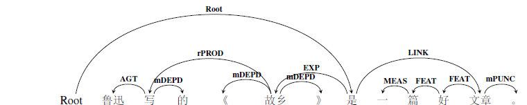
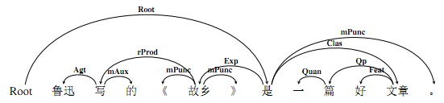
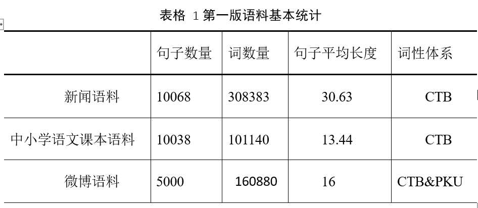

# 一、语义依存图标注概述

## 1.1 语义分析概述

语言具有三个重要层次：**音、形、义**。“`音`”指语音，是语言的声音表现形式；“`形`”主要指句法，是语言的构造方式；而“`义`”则为语义，代表语言的意义。这三个层面中，意义是最重要的一个层面，没有“意义”的语言是没有价值的，因为如果没有了意义，无论声音还是形体，都无法用其来进行交流，语言也就失去了价值。尤其对于汉语来讲，汉语的语法特性是以意义为基础、以语序以及虚词的运用为主要语法手段、以音律为辅助手段的。汉语语序灵活，以意义作为排列依据。传统的仅将句子分成若干个句法成分的句法研究在分析句子意义时是有一定局限性的，句义研究仅靠句法研究是不够的。多年来，人们对语音和句法的研究取得了很大的进展，但如何对语义知识进行表达与获取，一直都还是个难题。自然语言处理的核心任务就是使计算机能够像人一样知道每个词、每个句子、每个段落的“意思”，如何对语义知识进行正确表达和自动分析则是必经之路。

对句子进行语义分析，简单地说，就是指根据句子的句法结构和句中每个词的词义信息，将句子转化为某种可以表达句子意义的形式化表示。语言学界在面向自然语言处理的语义分析领域，也有多种知识描述形式的探索，包括语义分类、语义特征、语义聚合关系、语义组合限制等。目前在句义方面的研究主要集中在**语义角色标注（*Semantic Role Labeling, SRL*）**这种浅层语义分析的任务上，这种浅层语义分析对句子意义的理解不够深入，存在一定的局限性，进行更深层次的语义分析才是真正理解句义的唯一途径。

相较于语义角色标注，语义依存分析属于更深层次的语义分析。**语义依存分析**（*Semantic Dependency Parsing*）是建立在依存理论基础上的深层语义分析。它是一种融合了句子中的依存结构和语义信息的语义分析方法，更好地表达了句子的结构与语义关系。语义依存分析提取句子中所有的修饰词与核心词对间的语义关系，句子中的每一个词都有其核心节点（除了整个句子的核心节点外）。语义依存分析是处理词级别、短语级别、从句级别以及句子级别的语义结构的过程，是面向整个句子的深层分析，并且还含有非主要位于包含的语义信息，如数量（quantity）、属性（attribute）等。

对于语义依存分析，我们经历了由依存树结构向依存图结构发展的过程。**语义依存树是单一父节点、无环、连通、可投射的**，符合依存理论的四条公理。但是真实语言现象中经常会出现某个词语同时依存多个词语，即同时和句中其他多个词语发生语义关联从而拥有多个父节点的现象；也可能出现依存弧相互交叉的非投射现象。这些现象是传统的依存树结构无法表达的。为了将这些真实存在的语言现象显现出来，同时还能兼顾依存表达的优势，我们突破了原有的依存树结构表达的限制，提出了语义依存图结构。即在标注过程中，**只要句子中的词与词之间存在语义关系，就将这两个词语节点用依存弧进行连接**。

本规范将对语义依存图理论进行详细解释并介绍相应的语料库构建情况，同时对于标注细则进行全面的描述。一方面希望能够对语义知识进行全面而有效的描述；另一方面也希望能为提高机器自动语义标注提供更好的标注知识，从而提高语义自动标注的性能。

## 1.2 相关理论简介

在语义依存图语料库建设过程中，用到的语言学理论以语义依存理论为主，兼参考谓词论元结构。

语义依存分析是绝对基础，主要是对语义事件进行依存关系分析。第一版语料库的标注全部都是基于语义依存关系的。后来，对数量庞大的语义依存关系标签进行粒度上的提升，形成了粗细两层标注颗粒度，其中粗粒度标注粒度主要是分析某一语义事件的谓词-论元结构，并对这个结构进行依存标注，也即对于一些依附性的成分进行了简化处理。所以说，理论基础仍然是语义依存理论，但是在粗粒度标注框架中，涉及到了对谓词-论元结构的分析与标注。

下面是对这两种语义理论的介绍。

### 1.2.1 语义依存图理论简介

为了如何让计算机更好的理解人类自然语言所表达的丰富含义，我们采用语义依存图结构表达中文句子内部的语义依存关系。

语义依存分析是建立在`依存语法（Dependency Grammar，DG）`基础上，依存语法描述了句子中词与词之间的依存结构，法国语言学家Robinson将依存语法总结为以下四个公理： 

1. **一个句子中只有一个成分是核心成分；**
2. **其他成分直接依存于某一成分；**
3. **任何成分不能依存于两个或两个以上的成分；**
4. **依存成分之间不能有交叉。**

相应地，**语义依存分析是分析句子中所有词与词之间的结构关系以及有结构关系的词对间的语义关系，也即句子中的任何词语都有其父节点（整个句子的核心成分除外）它面向整个句子以及句子中所有的词**。

例如：鲁迅写的《故乡》是一篇好文章。（root，是）

语义依存图标注结果如下图所示：第一个图是粗粒度标注标签示例，第二个图是细粒度标注标签示例。

图 1语义依存图示例1（粗粒度）

图 2语义依存图示例2（细粒度）

从例子中可以看出，一个句子经过了语义依存分析后，既可以得到句子的结构信息，比如知道了词与词的相互依存（如“`好`”依存于“`文章`”），短语和词的依存等（“`一篇好文章`”依存于“`是`”）；也可以得到语义信息，包括谓词和论元间的语义信息（如“`是`”和“`文章`”间的语义关系是`类指关系Clas`），也包括短语内部的语义信息（如“`一篇`”和“`文章`”是`名量关系`）。经过了语义依存分析后，一个句子被彻底“解构”，被彻底“分析”，是一种真正的深层语义分析。

以往的语义依存研究大多基于依存树进行分析，但是根据大规模真实语料的实际，同时也考虑到中文灵活多变，经常出现连动、兼语、概念转位等现象，我们的标注结构从原来的依存树结构改为依存图结构。举例来说，现代汉语中经常会出现句子中的某个词语可以和句中多个词语发生语义关联的现象，间隔的词语对之间也会出现交叉关联的情况。例如：我有个妹妹很能干。从依存树分析的结果来看，“妹妹”的父节点是“有”表属事关系，但是“能干”与“妹妹”之间也有语义关系，却没有被标识出来。再比如：她心情不好，不愿意说话。依存树的分析中“她”的父节点是“心情”表示领属关系，但是“说话”与“她”之间也存在表示施事的语义关系，却没有表示出来，因此，语义依存树结构对汉语语义的刻画还存在一定局限性。

### 1.2.2 谓词-论元结构简介

人类所有的语言在它们的语义结构的核心部分都有一种谓词论元排列的形式，叫做"谓词论元结构"（Predicate-argument
Sturcture）。这种谓词论元结构表示了隐藏在构成句子的单词和短语的成分的底层之下的各个概念之间存在着的特定关系。

句子中必须包含或隐含谓词信息，而每一个谓词对应着一个或几个事件，事件的参与者就是它的论元。例如"张三走了"，"张三"就是谓词"走"的论元。

## 1.3语义依存图语料库建设

我们构建了两版语义依存分析语料库：BH-SDP-v1：第一版标注了1万句语义依存树库。采用了先自动转换CPB的语料，再进行人工标注的方式；BH-SDP-v2：第二版构建了一个包含2万个句子的语义依存图库，所有句子均为人工标注。这些语料都来自于不同的领域，包括新闻语料（10068）、中小学语文课本（10038）、新浪微博语料（5000）和用于机器翻译的语料（4900）。其中，微博语料的标注结果还有待进一步优化。

在标注过程中，也尝试了不同的词性规范体系，包括CTB（Chinese Penn Tree
Bank）的词性体系和北京大学计算语言学研究所人民日报词性标注体系（PKU）。不同来源的数据的句子长度，词次和词性体系如下表所示。

